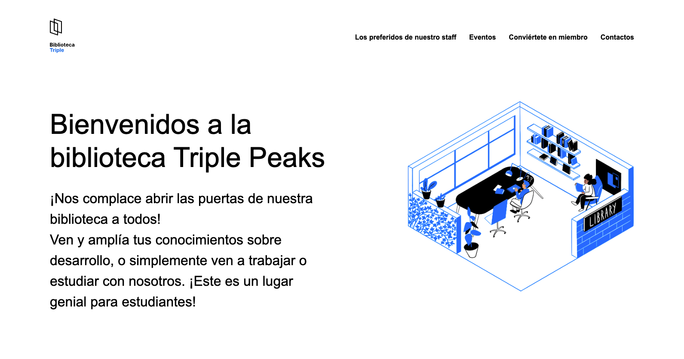

# Biblioteca Triple Peaks

¡Bienvenido a la Biblioteca Triple Peaks! Este es un proyecto de sitio web para la biblioteca local que proporciona información sobre los servicios y eventos que ofrecemos, así como los libros favoritos de nuestros lectores.

## 📋 Descripción

La Biblioteca Triple Peaks es un lugar acogedor para estudiar, trabajar y ampliar conocimientos. Este sitio web está diseñado para facilitar la navegación y proporcionar toda la información relevante sobre la biblioteca, incluyendo:

- Información sobre la biblioteca y su ubicación
- Los libros favoritos de nuestros lectores
- Eventos y actividades programadas
- Cómo convertirse en miembro de la biblioteca
- Información de contacto

## 📁 Estructura del Proyecto
```
biblioteca-triple-peaks/
│
├── index.html                      # Página principal de la biblioteca
├── styles/
│   ├── normalize.css               # CSS para normalizar estilos
│   └── style.css                   # Estilos personalizados para la página
├── images/
│   ├── logo.svg                    # Logotipo de la biblioteca
│   ├── inside_the_library.png      # Imagen de la biblioteca
│   └── index.png                   # Captura de la página principal
├── vendor/
│   └── normalize.css               # Archivo de normalización de CSS
└── README.md                       # Documentación del proyecto
```

## 🛠️ Tecnologías Utilizadas

- **HTML5** - Estructura semántica del contenido
- **CSS3** - Diseño y estilos visuales
- **Normalize.css** - Normalización de estilos entre navegadores

## 🚀 Cómo Ver el Proyecto

Para visualizar el proyecto en tu navegador local, sigue estos pasos:

1. **Clona el repositorio:**
```bash
   git clone https://github.com/luuzuriaga/biblioteca
```

2. **Navega al directorio del proyecto:**
```bash
   cd biblioteca
```

3. **Abre el archivo en tu navegador:**
   - Haz doble clic en `index.html`, o
   - Abre el archivo desde tu navegador preferido

## 📸 Capturas de Pantalla

### Página Principal


## 📄 Licencia

Este proyecto está bajo la Licencia MIT.

## 📧 Contacto

Si tienes alguna pregunta o sugerencia, no dudes en ponerte en contacto con nosotros.

---

¡Gracias por visitar la Biblioteca Triple Peaks! 📚
